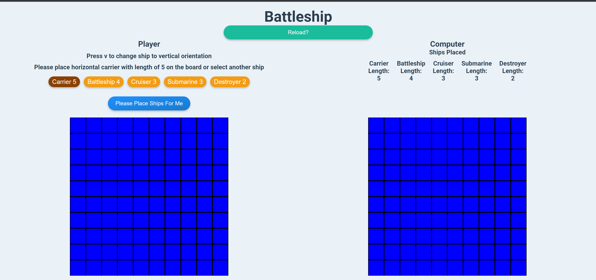

# Battleship

I created a battleship game based on the famous board game by Mattel. The game is played on a 10x10 grid. The player and the computer each have 5 ships. The player and the computer take turns guessing where the other player's ships are located. The first player to sink all of the other player's ships wins.

<h3>
  <a
    href="https://shoneriki.github.io/battleship-project/
"
    target="_blank"
  >
    Live Demo
  </a>
    👈
</h3>

## Technologies Used

- React
- React Testing Library
- Styled Components

## Installation Instructions

1. Clone down this repo
2. Run `npm install`
3. Run `npm start`
4. Open `localhost:3000` in your browser
5. You should be able to play the game on your machine

... Or you can head to this deployed link right here and play it without installation: [Battleship Project](https://shoneriki.github.io/battleship-project)

## How to play

### Setup

- The computer will place its ships randomly when it loads, but you will not see where they are for obvious reasons.
- You will then place your ships on the board.

### Placing Ships

- You have two options for placing ships:
  1. Select one of the 5 ship buttons. By default, the first ship is the carrier ship with a length of five.
  2. Switch the orientation of the current ship with either `h` or `v` keys (for horizontal or vertical orientations; for mobile/tablet modes, there is a button to change the orientation) and place the ship on the board by clicking or tapping on the board.
  3. Select the next ship to place and repeat the process until all 5 ships are placed.
  4. Alternatively, click the "Please Place Ships For Me" button which will place the ships for you.

### Gameplay

- Once all ships are placed, the current ship stats for both sides will be near their respective boards.
- Playing the game is simple:
  1. It will be your turn first. Click a cell on the Computer's board.
  2. The computer also takes a turn and clicks a square on your board.
  3. When you hit the computer's ship, the cell will turn red. If it's a miss, the square will turn gray. Regardless of the outcome, it will become the computer's turn next.
  4. If the computer hits one of your ships, the cell will not only turn red, but you will get a toast notification as to which ship was hit. If it's a miss, the cell will just turn gray and it will become your turn again.
  5. Each time a ship on either side is sunk, you will get a toast notification as to which ship was sunk.
  6. The game ends when either you or the computer sinks all of the other player's ships.

## Future Iterations

This is a very basic version of the game, and I would like to add more features to it, such as:

- Refactoring the app heavily in the codebase.
- Implementing a simple backend for storing states and making it a full-stack application.
- Improving test-driven development for this project.
- Developing a smarter AI with better strategies for targeting ships.
- implement a splash sound for a missed shot, and some sort of explosive sound for a hit shot
- implement actual ship images for the ships
